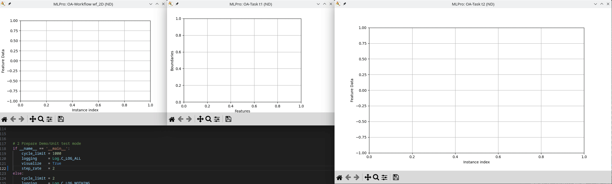

.. _Howto_OA_CA_003:
Howto OA-CA-003: Run KMeans on normalized static 2D point clouds
================================================================

**Executable code**

.. literalinclude:: ../../../../../test/howtos/oa/howto_oa_ca_003_run_kmeans_2d_static_normalized.py
	:language: python

**Results**

**Cross Reference**
    - :ref:`API Reference: Wrappers for River Cluster Analyzers <api_ca>`
