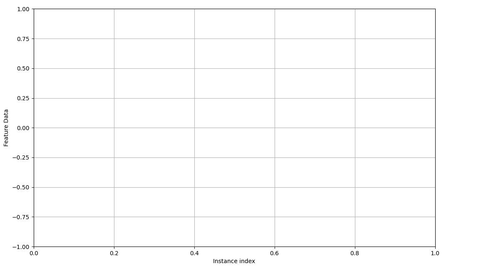

.. _Howto_OA_CA_021:
Howto OA-CA-001: Run CluStream on static 2D point clouds
========================================================

**Executable code**

.. literalinclude:: ../../../../../test/howtos/oa/howto_oa_ca_021_run_clustream_2d_static.py
	:language: python

**Results**

**Cross Reference**
    - :ref:`API Reference: Wrappers for River Cluster Analyzers <api_ca>`
