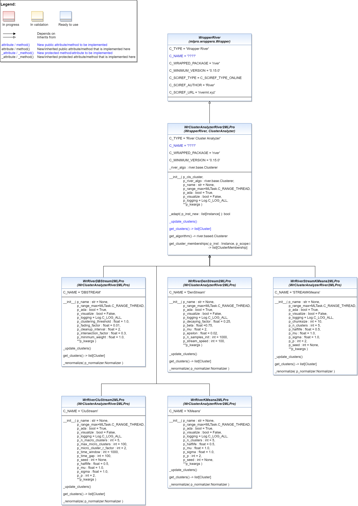

.. _api_ca:
Wrappers for River Cluster Analyzers
====================================

.. automodule:: mlpro_int_river.wrappers.clusteranalyzers.basics
    :members:
    :undoc-members:
    :private-members:
    :show-inheritance:
   
.. automodule:: mlpro_int_river.wrappers.clusteranalyzers.clustream
    :members:
    :undoc-members:
    :private-members:
    :show-inheritance:

.. automodule:: mlpro_int_river.wrappers.clusteranalyzers.dbstream
    :members:
    :undoc-members:
    :private-members:
    :show-inheritance:

.. automodule:: mlpro_int_river.wrappers.clusteranalyzers.denstream
    :members:
    :undoc-members:
    :private-members:
    :show-inheritance:

.. automodule:: mlpro_int_river.wrappers.clusteranalyzers.kmeans
    :members:
    :undoc-members:
    :private-members:
    :show-inheritance:

.. automodule:: mlpro_int_river.wrappers.clusteranalyzers.streamkmeans
    :members:
    :undoc-members:
    :private-members:
    :show-inheritance:
